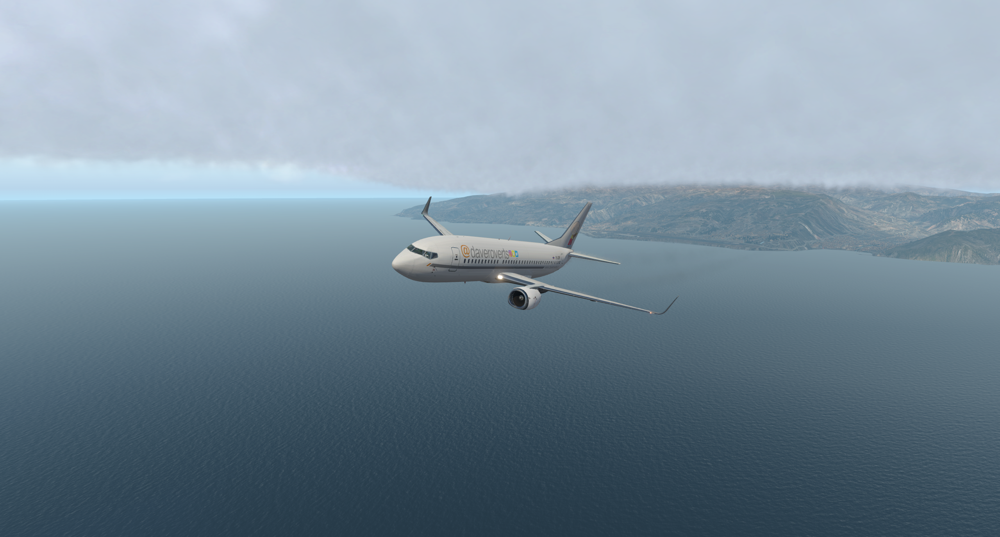
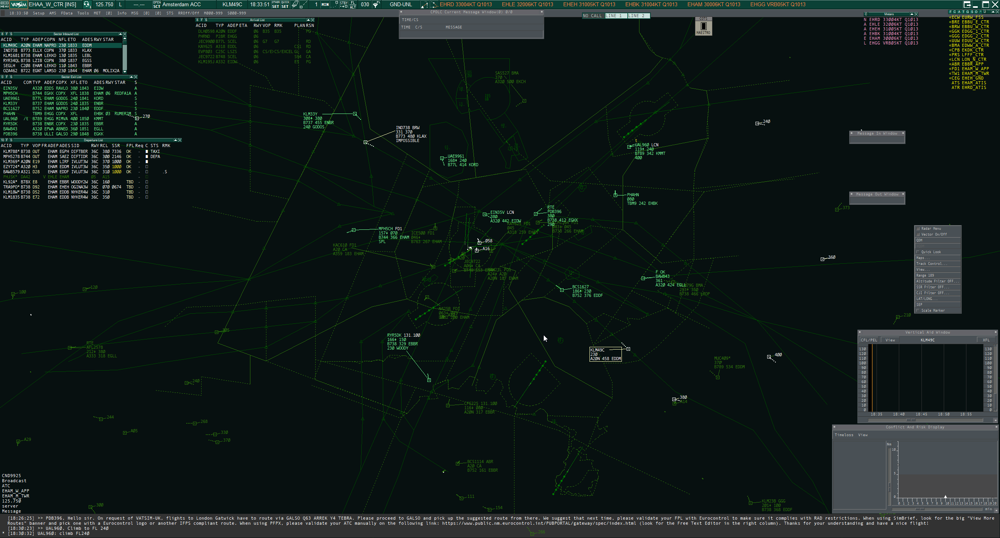

Hello there! 👋

I'm Dave Roverts, 24 years old and from the Netherlands 🇳🇱. Web developer 🖥 by day, and flight simmer ✈️ in the evening.

At the time of writing, I use the following flight sims and aircraft:
- Prepar3D V5
    - PMDG 737 NGXu
    - PMDG 747 QOTSII
    - PMDG 777
    - FSLabs A320
    - FSLabs A319
    - Qualitywings 787
- X-Plane 11
    - Zibo 737-800
    - IXEG 737-300
    - Toliss A319
    - Toliss A321
    - Flight Factor A320
    - iniSimulations A300
    - iniSimulations A300 Beluga

### Online flying / ATC
All my flights are flown on the [VATSIM network](https://www.vatsim.net/).

Next to flying, I'm also a controller currently holding both C3 and I1 ratings. My home division is the [Dutch VACC](https://www.dutchvacc.nl).

Usually, you will find me controlling EHAA_CTR, which covers the Netherlands.

